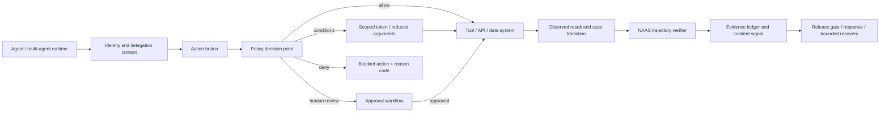

# NAAS Agent Trust & Control Plane

> **Audience:** product engineers, security architects, researchers, buyers, and reviewers.
> **Document role:** target architecture and staged product direction.
> **Current implementation truth:** [`.memory/naas_verification_truth.md`](../../.memory/naas_verification_truth.md).
> **Existing verifier law:** [`NAAS_VERIFICATION_LAYER.md`](NAAS_VERIFICATION_LAYER.md).
> **Decision record:** [`ADR-017-agent-trust-control-plane.md`](../adr/ADR-017-agent-trust-control-plane.md).
> **Investment and ROI evidence:** [`AGENT_ACTION_ASSURANCE_INVESTMENT_CASE.md`](../commercial/AGENT_ACTION_ASSURANCE_INVESTMENT_CASE.md).

## 1. Product definition

**NAAS Agent Action Assurance** is the initial product wedge: independent, evidence-producing verification that an AI agent followed the required constraints, state transitions, and tool-use policy—not merely that its final answer looked correct.

**NAAS Agent Trust & Control Plane** is the target architecture: a control layer between autonomous agents and consequential tools or systems. Its intended responsibility is to make every sensitive action attributable, authorized, policy-evaluated, observable, reviewable, and recoverable where the underlying operation permits recovery.

```text
Agent intent
    ↓
Identity and delegated authority
    ↓
Action request + context + policy evaluation
    ↓
ALLOW | ALLOW_WITH_CONDITIONS | REQUIRE_HUMAN | DENY
    ↓
Tool execution
    ↓
Post-condition verification + evidence + incident response
```

The durable problem is not a particular model, prompt, or framework. It is **accountable delegation**: when software acts for a person or organisation, who authorized the action, which constraints applied, what actually happened, and what evidence remains?

## 2. Credibility boundary: now, next, and later

This separation is normative. A roadmap item is not an implemented capability.

| Horizon | Status | Defensible claim |
|---|---|---|
| **NOW — trajectory verification** | Implemented within the limits in the live truth file | The verifier evaluates supplied trajectories across observable outcomes, intermediate constraints, state transitions, tool use, and final outcome, then emits a verdict tied to reproducible evidence. |
| **NEXT — external Agent Action Assurance** | Target; not production-proven | Ingest an authorized third-party agent trace, compile customer policy into constraints, replay the trajectory, compare against a baseline, and produce a release-gate evidence bundle. |
| **THEN — shadow runtime** | Target; absent | Observe proposed and completed actions without blocking them; measure decision quality, false positives, latency, and policy coverage. |
| **LATER — inline control plane** | Target; absent | Intercept action requests and enforce allow, conditional allow, human approval, or deny decisions before execution. |
| **FUTURE — multi-agent trust fabric** | Research direction; absent | Identity, delegation chains, cross-agent authorization, continuous evidence, bounded intervention, and recovery across heterogeneous autonomous systems. |

The current repository does **not** claim a live action gateway, agent identity service, runtime authorization, human-approval workflow, anomaly detector, kill switch, universal rollback, legal compliance, or safety guarantee. Promotion requires the evidence gates in §10.

## 3. The problem NAAS is designed to expose

A final response can be correct while the execution path is unacceptable:

- the agent reports a cancellation but never invokes the cancellation tool;
- it updates the wrong customer record;
- it invokes the correct tool with an amount above delegated authority;
- it skips a required approval state;
- it delegates to another agent that lacks the original authority;
- it reaches a plausible result by reading a forbidden source;
- it cannot prove which policy and authorization governed the action.

These failures overlap with security, evaluation, observability, identity, and governance. NAAS does not claim those neighbouring disciplines ignore actions. Its proposed differentiation is the composition of:

1. **trajectory-level verification** rather than final-output grading alone;
2. **customer-policy-grounded constraints** rather than generic quality scores;
3. **reproducible evidence** rather than an unauditable scalar;
4. **multilingual, dialect, and code-switching evaluation** as the initial wedge;
5. **cross-model and cross-runtime independence** as the long-term position.

## 4. Initial buyer and paid problem

The first target is not every enterprise using AI. It is an **Arabic-first voice or text agent vendor serving GCC customers**, where agents perform consequential customer-service actions such as bookings, refunds, account changes, ticket transitions, or access to regulated data.

The likely initial buyer is a CTO, Chief AI Officer, product-security lead, or deployment owner who needs to answer:

> Can we demonstrate that this agent used the correct tool, under the correct authority and policy, and produced the required system state before we release or renew it?

The initial offer remains a bounded pre-production assurance engagement. Buyer, price, budget owner, and willingness to renew remain hypotheses until documented customer evidence advances the commercial gates.

The investment case defines the customer ROI equation, financing gates, competitive falsification tests, and the 90-day path from research to paid evidence. It deliberately does not convert research, regulation, funding, or acquisitions into NAAS revenue claims.

## 5. Target architecture



### 5.1 Agent identity and delegation

Target responsibilities:

- stable workload identity separate from a human account;
- owner, purpose, environment, and lifecycle metadata;
- explicit delegation from a user or service;
- short-lived, scoped credentials;
- delegation-chain preservation across agent handoffs;
- revocation and expiry.

Authentication proves an identity. Authorization decides whether that identity may perform **this action, on this resource, in this context, for this delegator**. They are not interchangeable.

### 5.2 Action broker and policy decision point

The target broker receives a typed action envelope before a sensitive tool call:

```text
agent identity · delegator · action · resource · arguments
purpose · environment · risk class · policy version · correlation id
```

The policy decision must be deterministic where possible, return a reason code, and support four bounded outcomes:

- `ALLOW`
- `ALLOW_WITH_CONDITIONS`
- `REQUIRE_HUMAN`
- `DENY`

Policy evaluation should not depend solely on a language model. A model may help classify context or generate candidate tests, but deterministic policy and post-condition checks remain authoritative within their declared scope.

### 5.3 Human oversight

Human approval is a controlled workflow, not a button added after the architecture:

- show the proposed action, scope, affected resources, policy reason, and expected impact;
- bind approval to an exact action digest and expiry;
- reject replay after arguments or context change;
- record approver identity and decision;
- define timeout as an explicit deny, pause, or customer-selected policy—never implicit success;
- prevent approval fatigue through risk-tiering and measurable escalation quality.

### 5.4 Execution and post-condition verification

Authorization before execution is necessary but insufficient. The system must compare intended and observed outcomes:

- was the selected tool the authorized tool?
- were arguments unchanged after approval?
- did the external system reach the expected state?
- did an intermediate constraint fail even when the final response looked correct?
- was the operation idempotent, duplicated, partially completed, or timed out?

This is where the existing five-dimensional NAAS verifier becomes a foundation rather than a discarded prototype.

### 5.5 Evidence and audit

An evidence event should bind:

- actor and delegated principal;
- action, resource, and normalized arguments;
- policy and policy version;
- decision and reason code;
- human approval when required;
- tool result and observed state transition;
- verifier verdict and coverage limits;
- timestamps, correlation identifiers, and integrity metadata.

Evidence must minimize sensitive payloads, separate metadata from secrets, define retention, and support customer-controlled storage. “Tamper-evident” requires a specified integrity mechanism and verification procedure; an append-only database label alone is not proof.

### 5.6 Intervention and recovery

The target system may pause a session, revoke credentials, isolate a tool, deny a call, or open an incident. It must not promise universal rollback. Some actions—messages, disclosures, external side effects, or settled transfers—are irreversible. Recovery therefore uses a declared hierarchy:

1. prevent before execution;
2. make execution idempotent where possible;
3. use transactional rollback where supported;
4. invoke a tested compensating action where defined;
5. otherwise contain, disclose, investigate, and preserve evidence.

## 6. Fail-safe runtime requirements

An inline control plane becomes critical infrastructure. It cannot be promoted from shadow mode until it defines and tests:

- per-action fail-open or fail-closed policy;
- latency budgets and timeout semantics;
- high availability and degraded-mode behaviour;
- idempotency, retries, duplicate suppression, and partial-failure handling;
- policy versioning, rollback, simulation, and staged rollout;
- credential isolation and secret redaction;
- tenant and regional data boundaries;
- signed or otherwise verifiable decision/evidence integrity;
- emergency revocation that cannot silently become permanent outage;
- observability for policy decisions without logging sensitive content by default.

No single global default is safe. Reading a public catalogue and transferring funds require different failure policies.

## 7. Threat and failure model

The control plane addresses both adversarial and non-adversarial failure:

| Class | Examples | Primary controls |
|---|---|---|
| External manipulation | prompt injection, malicious tool output, poisoned context | input provenance, least privilege, policy checks, isolation, adversarial tests |
| Benign agent error | wrong customer, wrong amount, omitted tool call, invalid state transition | typed actions, preconditions, post-conditions, trajectory verification |
| Authority failure | excessive privilege, confused deputy, broken delegation, stale credential | workload identity, scoped tokens, delegation chain, revocation |
| Multi-agent failure | unauthorized handoff, responsibility loss, cyclic delegation | transitive-policy limits, handoff evidence, bounded depth and budget |
| Operational failure | timeout, duplicate call, partial completion, unavailable policy service | idempotency, explicit timeout policy, reconciliation, degraded-mode tests |
| Insider or supply-chain failure | altered policy, compromised connector, poisoned dependency | change approval, provenance, signed artifacts, separation of duties |
| Evidence failure | missing event, mutable log, sensitive payload leak | fail-loud ingestion, integrity verification, minimization, retention controls |

The system sells scoped evidence and control. It does not certify that an agent is universally safe.

## 8. Standards and research alignment

| Source | Local architectural use | Boundary |
|---|---|---|
| [NIST AI Agent Standards Initiative](https://www.nist.gov/artificial-intelligence/ai-agent-standards-initiative) | agent identity, authorization, secure interoperability, security evaluation | an initiative and standards programme, not proof that this product conforms |
| [NIST AI RMF 1.0](https://www.nist.gov/itl/ai-risk-management-framework) | Govern, Map, Measure, Manage lifecycle and evidence discipline | voluntary framework; implementation requires scoped evidence |
| [EU AI Act](https://digital-strategy.ec.europa.eu/en/policies/regulatory-framework-ai) | logging, traceability, risk management, human oversight, robustness, post-market monitoring for applicable systems | this project does not provide legal advice or claim compliance |
| [ISO/IEC 42001](https://www.iso.org/standard/42001) | AI management-system processes and continual improvement | citing the standard is not certification |
| [OWASP AI Agent Security Cheat Sheet](https://cheatsheetseries.owasp.org/cheatsheets/AI_Agent_Security_Cheat_Sheet.html) | tool abuse, excessive autonomy, memory poisoning, data leakage, human approval | guidance, not a complete threat model or guarantee |
| [OAuth 2.0 Security BCP — RFC 9700](https://www.rfc-editor.org/rfc/rfc9700.html) | delegated authorization and current OAuth security practice | does not by itself model semantic action authority |
| [OpenID Connect Core](https://openid.net/specs/openid-connect-core-1_0.html) | interoperable authentication claims | authentication is not authorization |
| [SPIFFE](https://spiffe.io/docs/latest/spiffe-about/overview/) | workload identity in heterogeneous infrastructure | adoption requires an explicit ADR and operating model |
| [OpenTelemetry](https://opentelemetry.io/docs/specs/otel/) | trace and correlation semantics | telemetry must be minimized and must not become the evidence root automatically |
| [Cedar](https://docs.cedarpolicy.com/) and [Open Policy Agent](https://www.openpolicyagent.org/docs/latest/) | candidate policy engines for explicit authorization | no engine is adopted by this document; selection needs benchmarks and an ADR |
| [in-toto](https://in-toto.io/) and [SLSA](https://slsa.dev/spec/v1.2/) | inspiration for verifiable provenance and attestations | software-supply-chain attestations are not automatically agent-action evidence |
| [Model Context Protocol security guidance](https://modelcontextprotocol.io/specification/2025-06-18/basic/security_best_practices) | consent, confused-deputy and token-handling risks around tool ecosystems | MCP is one integration, not the product boundary |

Research and standards guide requirements. They do not convert an absent module into an active capability.

## 9. Competitive position

The market is not empty. Relevant alternatives include:

- AI security and runtime-governance platforms;
- evaluation and observability suites that inspect traces and tool calls;
- identity and authorization vendors extending to AI agents;
- model, cloud, and agent-runtime native controls;
- MCP gateways, human-approval libraries, policy engines, and customer-built systems.

`Agent Action Assurance` is therefore a **positioning and product hypothesis**, not a claim that NAAS invented an uncontested category. Defensibility must be earned through:

- permissioned multilingual failure trajectories and remediation outcomes;
- reusable sector policy graphs;
- held-out customer evidence showing lift over current QA and security controls;
- integrations into agent runtimes, contact centres, CI/CD, and systems of record;
- measured reduction in release risk, review effort, incident rate, or procurement friction;
- independent operation across models and clouds.

## 10. Evidence-gated roadmap

| Gate | Required evidence | Promotion enabled |
|---|---|---|
| **A — external truth** | one authorized third-party trajectory ingested and judged; reproducible bundle; no production secrets | claim external trace compatibility within that exact adapter scope |
| **B — customer value** | three unrelated paid pilots; same paid problem; customer-confirmed severe failure missed by existing process | productize the repeated pre-production workflow |
| **C — repeatability** | at least 70% reusable checks/integration; one renewal; measured delivery cost and margin | recurring Agent Action Assurance offer |
| **D — shadow safety** | held-out decision quality, false-positive/negative analysis, latency, coverage, and no blocking side effects | deploy non-blocking runtime observation |
| **E — bounded enforcement** | customer-approved action class; fail-mode tests; HA/SLO evidence; approval integrity; incident drill | inline enforcement for that bounded action class only |
| **F — platform expansion** | multiple runtimes and sectors; retention; independent sales; security/privacy review | broader control-plane claim within evidenced boundaries |

Stop or pivot if buyers do not allocate a budget, pilots do not convert, every customer requires a new ontology, generic controls match the result, data cannot be accessed lawfully, or runtime intervention cannot meet reliability requirements.

## 11. Initial demonstrator

The first demonstrator should prove the current thesis without pretending to be the future platform:

1. a sandboxed Arabic customer-service agent receives an order-cancellation request;
2. one trajectory cancels the wrong order, exceeds delegated scope, skips an approval state, or claims cancellation without a successful tool call;
3. the trace is adapted into the existing `Trajectory` type;
4. customer-style policy is compiled into the five verification dimensions;
5. NAAS returns `VIOLATED` with the exact constraints and a reproducible evidence bundle;
6. a baseline final-output grader is shown missing at least one path failure—only if the measured comparison supports that claim.

The demo must run in an authorized local or customer sandbox. It must not probe a third-party production system without permission.

## 12. Humanity and accountability

The purpose of this architecture is not to promise infallible machines. It is to preserve human agency as machines gain operational authority:

- people can see which authority was delegated;
- institutions can bound what software may do;
- high-impact actions can require meaningful human review;
- failures become reproducible evidence rather than disputed anecdotes;
- irreversible actions are treated more strictly than reversible ones;
- responsibility remains attributable instead of disappearing inside a chain of agents.

The enduring objective is **useful autonomy under accountable control**. Every claim remains scoped, falsifiable, and subordinate to the live truth file.

## 13. Validation commands

Run from the repository root:

```bash
python scripts/fitness/check_documentation_contract.py
python scripts/fitness/check_authority_links.py
python scripts/fitness/check_docs_runtime_parity.py
python scripts/fitness/check_naas_verification.py
pytest -q tests/fitness/test_documentation_contract_gate.py \
  tests/fitness/test_naas_verifier_boundary_gate.py \
  tests/architecture/test_naas_verification_gate.py
git diff --check
```

These commands validate documentation structure and existing verifier governance. They do not prove the absent runtime-control capabilities described as targets above.
