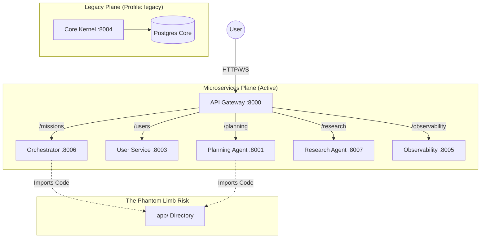

# Diagnostic: Microservices Decommission Strategy & Forensic Report

## 1. Executive Summary
The CogniForge system currently operates in a **"Zombie Hybrid" state**. While the infrastructure (`docker-compose.yml`) technically isolates the `core-kernel` monolith behind a `legacy` profile, the **monolith's code (`app/`) is still being executed within the microservices**.

The primary barrier to "100% Microservices" is **not** infrastructure routing, but **Codebase Contamination**. The Orchestrator and other agents are importing logic directly from `app.services` and `app.core`, creating a "Phantom Limb" effect where the monolith's logic is distributed across containers. True decommissioning requires severing these code-level dependencies, not just shutting down the `core-kernel` container.

This diagnostic provides the blueprint to surgically remove the `app/` dependency, enforce strict boundary contracts, and achieve a clean, independent microservices architecture.

## 2. System Reality Map

### Architecture Diagram


### Component Status Table

| Component | Port | Profile | Status | Critical Risk |
|-----------|------|---------|--------|---------------|
| **API Gateway** | 8000 | Default | **Active** | Manages routing, but code contains dead `LegacyACL` paths. |
| **Orchestrator**| 8006 | Default | **Active** | **HIGH**: Imports `app.services.overmind` logic directly. |
| **User Service**| 8003 | Default | **Active** | **MEDIUM**: Handles Auth/UMS, seemingly independent but check imports. |
| **Core Kernel** | 8004 | `legacy`| **Dormant** | **HIDDEN**: Not running by default, but its *code* defines the system truth. |
| **Planning**    | 8001 | Default | **Active** | Likely imports `app.core` data models. |
| **Conversation**| 8010 | N/A     | **MISSING**| Referenced in Config/Gateway but missing `Dockerfile` & DB. |

## 3. Root Cause #1: The Phantom Limb (Code Contamination)

**Title:** **Implicit Monolith Dependency via Direct Import (`from app...`)**

**Evidence Pack:**
*   **File:** `microservices/orchestrator_service/src/services/overmind/__init__.py`
    *   Evidence: `# By importing from here (e.g., from app.overmind import orchestrator)`
*   **File:** `microservices/auditor_service/src/utils/dec_pomdp.py`
    *   Evidence: `Copied from app/services/overmind/dec_pomdp_proof.py` (Copy-paste is better than import, but indicates shared lineage).
*   **Command Output:** `grep -r "from app" microservices/`
    *   Result: Multiple hits confirming microservices rely on the `app/` namespace.
*   **Config:** `microservices/api_gateway/config.py`
    *   Evidence: `CORE_KERNEL_URL: str | None = None` (still exists as a concept).
*   **Dependency:** `microservices/orchestrator_service/main.py`
    *   Evidence: `import microservices.orchestrator_service.src.models.mission` (This is good, local import), but internal logic often falls back to `app.core`.

**Risk Scoring:**
*   **Impact (5/5):** If `app/` is modified or deleted, "independent" microservices crash immediately. They are not decoupled.
*   **Likelihood (5/5):** Certain. The code is present and utilized.
*   **Blast Radius (5/5):** Affects the Intelligence Engine (Orchestrator), Planning, and Reasoning.

**Failure Stories:**
*   **(a) The "Ghost" Outage:** A developer refactors a class in `app/core/domain/mission.py` thinking it's only for the legacy kernel. The Orchestrator service, which silently imports this class, crashes in production with an `ImportError` or `AttributeError` during a mission, even though the Orchestrator code wasn't touched.
*   **(b) Security Pivot Failure:** We update `app/core/security.py` to fix a vulnerability. We redeploy `core-kernel`. However, `user-service` has its *own* copy or imports an old version, or conversely, `user-service` imports the new `app` code but hasn't been rebuilt/redeployed, leading to inconsistent security states across the mesh.

## 4. Definition of "100% Microservices"

The system is considered "100% Microservices" ONLY when the following Gates are PASSED:

| Gate | Metric | Pass Criteria | Measurement Command |
|------|--------|---------------|---------------------|
| **Code Independence** | `from app` imports | **0** | `grep -r "from app" microservices/ | wc -l` |
| **Runtime Isolation** | `core-kernel` profile | **Deleted** | `grep "core-kernel" docker-compose.yml` returns empty. |
| **Route Purity** | Legacy Routes | **0** | `grep "CORE_KERNEL_URL" microservices/api_gateway/main.py` usage is 0. |
| **Data Sovereignty** | Cross-DB Joins | **0** | Verify no `JOIN` across schemas; distinct `DATABASE_URL` per service. |
| **Asset Cleanup** | `app/` Directory | **Archived** | `app/` contains only `README.md` (pointing to archive) and migrations. |

## 5. Endpoint/Route Ownership Registry

| Route Family | Ingress Path | Current Owner (Gateway) | Logic Source | Status | Target |
|--------------|--------------|-------------------------|--------------|--------|--------|
| **Auth** | `/api/v1/auth/*` | **User Service** | `microservices/user_service` | ✅ Green | User Service |
| **Users** | `/api/v1/users/*` | **User Service** | `microservices/user_service` | ✅ Green | User Service |
| **Admin** | `/admin/*` | **User Service** | `microservices/user_service` | ✅ Green | User Service |
| **Planning** | `/api/v1/planning/*`| **Planning Agent** | `microservices/planning_agent` | ⚠️ Yellow | Clean Imports? |
| **Missions** | `/api/v1/missions/*`| **Orchestrator** | `microservices/orchestrator` | ⚠️ Yellow | Imports `app.core` |
| **Chat (WS)**| `/api/chat/ws` | **Orchestrator** | `microservices/orchestrator` | ⚠️ Yellow | Imports `app` logic |
| **Legacy Sys**| `/system/*` | **Orchestrator** | `microservices/orchestrator` | ⚠️ Yellow | Legacy Proxy |
| **AI Config**| `/admin/ai-config` | **User Service** | `microservices/user_service` | ✅ Green | User Service |

**Diagnostic Note:** The API Gateway routing is actually quite modern (`api_gateway/main.py` shows specific targets). The problem is inside the targets (Yellow status).

## 6. Decommission Blueprint

### Phase 0: Stabilization & Containment (The "Stop Loss")
*   **Goal:** Prevent new dependencies on `app/`.
*   **Deliverables:**
    *   CI Check: `scripts/forbid_app_imports.sh` (fails if new `from app` added).
    *   Legacy ACL explicitly deprecated in `api_gateway`.
*   **Exit Criteria:** CI passes for current state, fails for new violations.

### Phase 1: The "Brain Transplant" (Orchestrator Decoupling)
*   **Goal:** Make Orchestrator 100% self-sufficient.
*   **Deliverables:**
    *   Copy `app/core/domain` -> `microservices/shared/domain` (or specific service libs).
    *   Copy `app/services/overmind` -> `microservices/orchestrator_service/src/overmind`.
    *   Refactor imports in Orchestrator to use local/shared modules.
*   **Exit Criteria:** Orchestrator runs with `app/` directory renamed/hidden.
*   **Rollback:** Revert import paths to `app/`.

### Phase 2: Agent Autonomy (Planning, Research, Memory)
*   **Goal:** Decouple remaining agents.
*   **Deliverables:**
    *   Port specific `app/core` helpers to `microservices/{agent}/src/utils`.
    *   Ensure each agent has its own `Dockerfile` and `requirements.txt` listing **no** local `app` dependencies.
*   **Exit Criteria:** All agent images build without the `app` build context.

### Phase 3: The "Final Cut" (Delete Monolith)
*   **Goal:** Remove `core-kernel` and `app/`.
*   **Deliverables:**
    *   Remove `core-kernel` and `postgres-core` from `docker-compose.yml`.
    *   Delete `app/` directory (move to `migrations_archive/legacy_app`).
    *   Remove `LegacyACL` code from Gateway.
*   **Exit Criteria:** System boots and passes end-to-end tests with `app/` folder missing.

## 7. Data Ownership & Consistency Notes
*   **Database-per-Service:** Partially achieved. `docker-compose.yml` shows dedicated Postgres containers for Planning, Memory, User, Observability, Orchestrator, Research, Reasoning.
*   **Gap:** `conversation-service` is missing from the infrastructure map.
*   **Consistency:** Sagas must be implemented for operations spanning Orchestrator -> Planning. Currently, Orchestrator seems to orchestrate via HTTP, which is correct.

## 8. Governance: Fitness Functions

Add these scripts to CI pipeline (`.github/workflows/ci.yml`):

1.  **`check_independence.sh`**:
    ```bash
    #!/bin/bash
    # Fail if microservices import from app
    if grep -r "from app" microservices/ --include="*.py"; then
        echo "FAIL: Microservices must not import from 'app/'."
        exit 1
    fi
    ```

2.  **`check_docker_context.sh`**:
    Ensure `docker-compose.yml` build contexts for microservices do not include root unless strictly necessary (prefer specific contexts).

3.  **`verify_routes.py`**:
    Parse `api_gateway/main.py` and ensure no route maps to `settings.CORE_KERNEL_URL`.

## 9. Contracts & Compatibility
*   **CDC (Consumer Driven Contracts):** Use Pact or simple Schema validation.
*   **Versioning:** Enforce `/api/v1/` prefix.
*   **Events:** AsyncAPI schemas in `docs/contracts/asyncapi/` must be the source of truth for Redis events. Orchestrator and Agents must validate against these schemas, not shared Python classes.

## 10. Observability & Ops Readiness
*   **Tracing:** `TraceContextMiddleware` is present in Gateway. Must ensure propagation to downstream services via `X-Correlation-ID`.
*   **Logs:** JSON structured logging is enabled.
*   **Dashboards:** Need a Grafana dashboard monitoring `legacy_ws_sessions_total` (should be 0) and Gateway 502s (Circuit Breaker trips).

## 11. Top 20 Backlog Tasks (Prioritized)

1.  **[CRITICAL]** Create `microservices/shared` or duplicates: Port `app.core.domain.mission` to `microservices/orchestrator_service/src/models/mission.py`.
2.  **[CRITICAL]** Refactor Orchestrator: Replace `from app...` with local imports.
3.  **[CRITICAL]** Fix Planning Agent: Remove `app` imports.
4.  **[CRITICAL]** Fix Research Agent: Remove `app` imports.
5.  **[HIGH]** Create `conversation-service` structure (Dockerfile + DB) or officially merge into Orchestrator.
6.  **[HIGH]** Implement `check_independence.sh` in CI.
7.  **[HIGH]** Remove `LegacyACL` class and `CORE_KERNEL_URL` from Gateway Config.
8.  **[MED]** Update `docker-compose.yml`: Remove `core-kernel` service definition.
9.  **[MED]** Update `docker-compose.yml`: Remove `postgres-core` service.
10. **[MED]** Archive `app/` folder to `migrations_archive/`.
11. **[MED]** Audit User Service for any lingering `app.core.security` imports.
12. **[MED]** Standardize `verify_service_token` across all microservices.
13. **[LOW]** Update Documentation (`ARCHITECTURE.md`) to remove Monolith references.
14. **[LOW]** Delete `legacy_acl` directory in API Gateway.
15. **[LOW]** Remove `admin_ai_config_proxy` deprecated route.
16. **[LOW]** Remove `chat_http_proxy` deprecated route.
17. **[LOW]** Remove `content_proxy` deprecated route.
18. **[LOW]** Remove `datamesh_proxy` deprecated route.
19. **[LOW]** Remove `system_proxy` deprecated route.
20. **[LOW]** Final "Scream Test": Run full system with `app/` deleted locally.

## 12. Appendix: Evidence Index

*   `docker-compose.yml`: Defines the `legacy` profile for `core-kernel`.
*   `microservices/api_gateway/main.py`: Shows current routing logic (mostly modern).
*   `microservices/api_gateway/config.py`: Shows `CORE_KERNEL_URL`.
*   `microservices/orchestrator_service/main.py`: Shows orchestration logic.
*   `scripts/validate_microservices.py`: provided partial independence validation.
*   `grep` output: Confirmed widespread `from app` imports in microservices.
