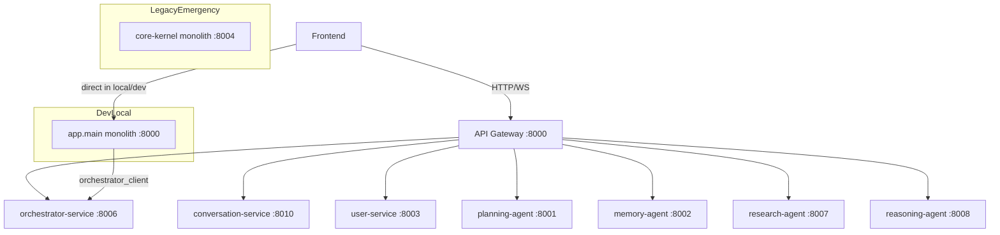

# 1. Executive Summary
The repository currently runs in **three materially different runtime modes** (default microservices compose, legacy/emergency compose, and local/dev monolith boot scripts), and the three chat journeys (admin normal chat, customer normal chat, super-agent mission) do **not** share a single authoritative control-plane in all modes.

Most critical forensic conclusion:
- In local/dev runtime (`uvicorn app.main:app`), **admin normal chat succeeds** because it stays inside monolith chat orchestration/boundaries/streamers.
- In the same runtime, **customer normal chat fails more often** because the customer WS handler bypasses the local boundary streamer and directly calls `orchestrator_client.chat_with_agent()` (remote dependency).
- **Super Agent / المهمة الخارقة fails for both roles** when executed through monolith mission handler path, because mission dispatch depends on `start_mission()` -> `orchestrator_client.create_mission()` and returns the explicit UI-facing message `Dispatch Failed` on exception.

In default docker microservices runtime, gateway rollout values are hard-set to 100% conversation routing for chat HTTP+WS, while `conversation-service` is a minimal parity stub that does not implement mission orchestration and does not emit the same event contract as monolith streamers. This creates another split behavior pattern and control-plane ambiguity.

The system is therefore **API-first partial**, **microservices partial**, with strong signs of **dangerous hybrid / split-brain architecture** rather than a fully decommissioned monolith.

# 2. Runtime Truth Map
## 2.1 Default runtime (docker-compose.yml)
- Primary ingress: `api-gateway` on `:8000`.
- Includes microservices: planning, memory, user, observability, orchestrator, research, reasoning, conversation, plus dedicated DBs/Redis.
- `frontend` points to gateway via `API_URL=http://api-gateway:8000`.
- Gateway chat routing canary is configured to **100% conversation-service** for both HTTP and WS paths.

## 2.2 Legacy/emergency runtime (docker-compose.legacy.yml)
- `core-kernel` and `postgres-core` are only active under `profiles: ["legacy", "emergency"]`.
- Breakglass env guards (`LEGACY_APPROVAL_TICKET`, `LEGACY_EXPIRES_AT`) required.
- This is explicitly a fallback runtime, but still operationally present.

## 2.3 Dev/local runtime
- `.devcontainer/docker-compose.host.yml` runs a single `web` container and does **not** start gateway/microservice mesh.
- `scripts/start_dev.sh`, `scripts/start-backend.sh`, and Makefile `run/dev` start monolith directly: `uvicorn app.main:app`.
- Result: live behavior can differ radically from default microservices compose.

## 2.4 Runtime topology mermaid

## 2.5 Component table (runtime truth)
| Component | Default compose | Legacy compose | Dev/local scripts | Notes |
|---|---|---|---|---|
| API Gateway | Active | Not defined | Usually absent | Authoritative only in default compose |
| Core Kernel monolith | Not in default file | Active by profile | Active via local scripts | Still live in practice |
| Orchestrator Service | Active | Not in legacy file | Often absent unless separately started | Hard dependency for customer + mission paths in monolith |
| Conversation Service | Active | Not in legacy file | Usually absent | Minimal parity stub, not full mission backend |
| Frontend | Active | not in legacy file | can run standalone | Behavior depends on env URL/WS URL |

# 3. Full System Inventory
| Component | Status | Responsibility | Ingress/API | WS ownership | Dependencies | Data ownership | Architectural assessment |
|---|---|---|---|---|---|---|---|
| api-gateway | Active | Route proxy, tokenized forwarding, WS proxy | `:8000` | Proxies `/api/chat/ws` + `/admin/api/chat/ws` | All backend services | None (control-plane only) | API-first facade exists, but routing policy causes split behavior |
| core-kernel (`app/`) | Active in dev + legacy | Monolith app, auth, admin/customer routers, local chat orchestration | `app.main` | Owns admin/customer WS when monolith runtime used | DB + AI + orchestrator client | Owns monolith tables | Dangerous residual authority; not fully retired |
| orchestrator-service | Active in default compose | Missions, chat endpoints, LangGraph run path, mission events WS | `/missions`, `/agent/chat`, `/api/chat/ws` | Owns mission WS + has chat WS endpoints | DB/Redis + agents | Mission/event store | Real orchestration engine exists but not sole owner in all runtimes |
| conversation-service | Active but minimal | Chat HTTP/WS parity shim | `/api/chat/*`, `/admin/api/chat/ws` | Accepts both chat WS routes | none substantial | none | Placeholder/partial; not mission-capable |
| planning-agent | Active | planning microservice | `/health` etc via gateway | N/A | postgres-planning | planning DB | Serviceized |
| memory-agent | Active | memory microservice | via gateway | N/A | postgres-memory | memory DB | Serviceized |
| research-agent | Active | research/search capabilities | via gateway | N/A | postgres-research | research DB | Serviceized |
| reasoning-agent | Active | reasoning APIs | via gateway | N/A | postgres-reasoning | reasoning DB | Serviceized |
| user-service | Active | auth/users/admin APIs | via gateway `/api/v1/users`, `/api/security`, `/admin/*` proxy path | none | postgres-user | user DB | Serviceized but admin proxy rewrites are fragile |
| observability-service | Active | observability APIs | via gateway | none | postgres-observability | observability DB | Serviceized |
| auditor-service | Dormant/partial | audit utility service code exists | not in default compose | none | unknown | unknown | Incomplete/dormant |
| ChatRoleDispatcher | Active in monolith | role-based boundary dispatch | internal | N/A | admin/customer boundaries | monolith chat state | Monolith control-plane only |
| MissionComplexHandler | Active in monolith | Super Agent trigger, mission dispatch polling loop | internal strategy | emits stream events to WS via streamer | orchestrator_client | indirect mission ID state | Bridge node prone to dispatch failure |
| DefaultChatHandler | Active in monolith | normal fallback chat | internal strategy | streamed by chat streamers | AI client | monolith conversations | Explains admin success when local monolith path used |

# 4. Agent Architecture Diagnosis
- Agent families exist in **both** monolith and orchestrator microservice trees (`app/services/overmind/...` and `microservices/orchestrator_service/src/services/overmind/...`) with extensive file-level mirroring.
- Orchestration authority is inconsistent:
  - Monolith `ChatOrchestrator` still performs intent handling and strategy execution locally.
  - Orchestrator microservice also exposes mission/chat endpoints and LangGraph execution.
- Chat authority is inconsistent:
  - In monolith runtime: admin WS uses dispatcher->boundaries->chat streamer path.
  - Customer WS in monolith directly uses `orchestrator_client.chat_with_agent` path.
  - In default gateway runtime: chat WS gets routed to conversation-service due 100% rollout configuration.

Boundary cleanliness assessment:
- **Broken**. Control-plane ownership is not singular by runtime nor by role.
- The system exhibits split-brain characteristics: route-level, runtime-level, and implementation-level.

# 5. Monolith Residue Diagnosis
## 5.1 Runtime/control-plane residues
**Evidence**
- `make run/dev` and scripts boot `app.main` directly.
- devcontainer uses only `web` monolith service.
- legacy compose keeps `core-kernel` emergency profile.

**Severity**: Critical.

**Why it matters**
- Production-like behavior cannot be reproduced consistently; role flows diverge by runtime profile.

**Direction to eliminate**
- Single mandatory ingress/runtime path with gateway+microservices only for all environments.

## 5.2 Import contamination residues
**Evidence**
- Direct `from app...` contamination in `microservices/` is currently low by grep (mostly tests), showing reduced hard import coupling.

**Severity**: Medium.

**Why it matters**
- Hard imports are not the main current failure vector; runtime and copy-coupling are.

**Direction**
- Keep enforcement gates, expand to generated docs/examples exclusion clarity.

## 5.3 Phantom-limb copy-coupling residues
**Evidence**
- Massive mirrored Overmind trees between monolith and orchestrator service (agents/domain/langgraph/graph/tools/etc.).

**Severity**: Critical.

**Why it matters**
- Behavioral drift risk; bug fixed in one brain may survive in the other.

**Direction**
- Hard ownership: one executable brain, one read-only compatibility shell, then delete duplicate limb.

## 5.4 State ownership residues
**Evidence**
- Monolith owns admin/customer conversation persistence.
- Orchestrator owns mission/event state.
- Conversation-service returns stateless envelopes.

**Severity**: Critical.

**Why it matters**
- No unified stategraph/chat session authority; cross-service consistency is accidental.

**Direction**
- Assign explicit bounded contexts: conversation domain service + orchestration domain service with contract-defined references only.

## 5.5 Documentation/runtime split-brain residues
**Evidence**
- One ADR says orchestrator microservice is removed/deprecated; current compose actively runs orchestrator-service.
- deployment docs reference non-existent compose files/ports inconsistent with live compose.
- route docs show conversation-service ownership while config registry targets orchestrator-service for same WS routes.

**Severity**: High.

**Why it matters**
- Engineers follow conflicting truth sources, reinforcing operational chaos.

**Direction**
- Enforce generated documentation from runtime manifests + route registry tests as release gates.

# 6. Admin Chat vs Customer Chat vs Super Agent Forensic Comparison
## 6.1 Deep comparison table
| Journey | Frontend entrypoint | Route | Handler owner | State owner | Target service/container | Key dependencies | Works/Fails | Why |
|---|---|---|---|---|---|---|---|---|
| Admin normal chat | `CogniForgeApp` endpoint `/admin/api/chat/ws` | In monolith runtime hits `app/api/routers/admin.py` WS | `ChatRoleDispatcher` -> `AdminChatBoundaryService` -> `AdminChatStreamer` -> `ChatOrchestrator` | monolith admin conversation tables | monolith app container/process | local AI + monolith services | Usually works | Entire path can execute locally without mandatory remote orchestrator for basic/default intents |
| Customer normal chat | `CogniForgeApp` endpoint `/api/chat/ws` | In monolith runtime hits `app/api/routers/customer_chat.py` WS | direct `orchestrator_client.chat_with_agent()` stream | mixed: monolith conversation persistence + remote agent output | remote `orchestrator-service` required | network/DNS to orchestrator + `/agent/chat` availability | Often fails | role-specific divergence: customer path is remote-coupled while admin path is local-orchestrated |
| Super Agent (mission_complex) | same WS with `mission_type: mission_complex` | monolith chat orchestration strategy | `MissionComplexHandler.execute()` | mission id/events expected from orchestrator service | `start_mission()` -> `orchestrator_client.create_mission()` | orchestrator `/missions` reachable + mission backend health | Fails for both roles when orchestrator not reachable/unhealthy | handler catches exception and emits explicit `Dispatch Failed` message |

## 6.2 Narrative reconstruction
### A) Admin normal chat
1. Frontend selects admin WS endpoint.
2. Admin WS endpoint validates token + admin role.
3. Dispatches to role dispatcher and admin boundary streamer.
4. Streamer uses local `ChatOrchestrator.process()` and returns typed events (`conversation_init`, `delta`, `complete`) that frontend hook understands.

### B) Customer normal chat
1. Frontend selects customer WS endpoint.
2. Customer WS validates token and non-admin role.
3. Instead of role dispatcher local path, it calls remote orchestrator client stream (`/agent/chat`).
4. Any connectivity/service error becomes streamed error; no local fallback equivalent to admin local path.

### C) Super Agent / المهمة الخارقة
1. Frontend sends payload with `mission_type=mission_complex`.
2. Chat orchestrator maps mission type to `MISSION_COMPLEX` intent.
3. `MissionComplexHandler` calls `start_mission()`.
4. `start_mission()` delegates to `orchestrator_client.create_mission()` (`POST /missions`).
5. On exception, handler emits Arabic error containing `(Dispatch Failed)` and aborts mission stream.

### Forensic conclusion
Yes, the three flows terminate on different architectural paths depending on runtime and role. This is the direct cause of asymmetrical success/failure.

# 7. Dispatch Failure Root Cause Analysis
## 7.1 Ranked hypotheses
1. **Highest confidence:** Orchestrator unreachability from monolith path (`orchestrator-service` DNS/port/service not available in local/dev runtime).
2. Orchestrator `/missions` endpoint unhealthy or failing startup dependencies (DB/Redis/tool registry).
3. Gateway/WebSocket path mismatch causing mission-type payload never to reach mission-capable backend (in default compose with conversation-service WS takeover).
4. Auth/protocol mismatch in WS subprotocol forwarding (lower confidence for `Dispatch Failed` string specifically).

## 7.2 Highest-confidence root cause
`Dispatch Failed` originates in `MissionComplexHandler` exception branch around mission dispatch:
- `MissionComplexHandler.execute()` -> `start_mission()` -> `orchestrator_client.create_mission()`.
- Any exception logs `Failed to dispatch mission` and emits user-facing message: `لم نتمكن من بدء المهمة (Dispatch Failed)`.

This is deterministic and directly visible in control flow.

## 7.3 Why it happens
- Monolith mission path is a strict proxy to orchestrator-service.
- In local/dev monolith-only runtime, orchestrator-service may not be started/resolvable.
- Therefore mission creation throws and the handler emits `Dispatch Failed` for both admin and customer.

# 8. StateGraph Diagnosis
## 8.1 Current state/workflow model
- Orchestrator microservice has an explicit LangGraph engine (`supervisor`, `contextualizer`, `strategist`, `architect`, `operator`, `auditor`, `loop_controller`) and chat WS endpoints that call `_run_chat_langgraph()`.
- Monolith also retains mirrored LangGraph/Overmind structures and its own chat orchestration strategies.

## 8.2 Is live system truly using it?
- **Partially.**
  - In monolith runtime, admin normal chat does not require orchestrator LangGraph live path for default intents.
  - Customer path may use remote `/agent/chat` (not the same as `/api/chat/ws` LangGraph route).
  - In default gateway runtime, chat WS may be sent to conversation-service stub due 100% rollout, bypassing orchestrator LangGraph WS path.

## 8.3 State ownership problems
- Chat session state: monolith DB.
- Mission state/events: orchestrator DB/Redis.
- Conversation-service: mostly stateless echo envelope.
- Frontend expects specific event schema from monolith streamer contract.

## 8.4 Why graph is isolated/broken
- Graph exists, but routing + runtime choice frequently bypasses it.
- WS target ownership and event contract are not normalized across backends.

# 9. Target StateGraph Architecture for 100% API-First Microservices
- **Single orchestration authority:** orchestrator-service owns mission and advanced chat workflow graph.
- **Conversation authority:** dedicated conversation-service owns chat conversations/messages/session metadata (DB + APIs + WS event contract).
- **Gateway:** deterministic route ownership (no hidden canary defaults for critical chat without contract compatibility validation).
- **State handoff model:**
  1. conversation-service receives user message, persists event and session state.
  2. emits command to orchestrator-service (HTTP command or async event).
  3. orchestrator-service executes StateGraph and emits progress events.
  4. conversation-service maps progress to stable frontend WS schema and persists assistant artifacts.
- **Retries/compensations:** explicit mission/chat run status machine with terminal states and idempotency keys.

# 10. Definition of “100% Microservices” for THIS repository
PASS/FAIL gates:
1. No monolith on default path: **FAIL** (local/dev scripts still default to monolith).
2. No admin/customer split-brain: **FAIL** (role-divergent backend logic in monolith WS routers).
3. No super-agent dispatch via legacy bridge: **FAIL** (MissionComplexHandler uses monolith bridge client).
4. No `app` contamination in microservices runtime path: **PARTIAL PASS** for direct imports, **FAIL** for copy-coupling.
5. No active duplicate brain: **FAIL** (mirrored overmind implementations).
6. Route ownership clarity: **FAIL** (docs/registry/runtime contradictions).
7. Stategraph live-path correctness: **FAIL** (graph often bypassed by routing/runtime).
8. Service completeness: **FAIL** (conversation-service is parity stub, not full conversation domain service).

# 11. Deep Modernization Blueprint
## Phase 0: containment & truth
- Goals: freeze runtime permutations; publish one authoritative runtime matrix.
- Deliverables: enforced environment profiles, route registry to runtime assertions, live dependency probes.
- Exit criteria: deterministic flow map for admin/customer/super-agent in CI.
- Rollback: keep emergency profile, but TTL-enforced breakglass only.
- Risks: hidden scripts bypassing control-plane.

## Phase 1: single chat/control plane
- Goals: unify admin/customer chat ingress and event contract.
- Deliverables: one WS contract, one chat command API, role policy at edge not divergent internals.
- Exit criteria: admin/customer both run through same backend path class.
- Rollback: feature flag to prior owner with controlled TTL.
- Risks: UI regressions due event schema changes.

## Phase 2: dispatch/stategraph normalization
- Goals: route super-agent mission dispatch only through orchestration API.
- Deliverables: explicit mission command endpoint, idempotency/retry semantics, contract tests.
- Exit criteria: no `Dispatch Failed` from bridge exceptions under healthy orchestrator.
- Rollback: queued command fallback with dead-letter visibility.
- Risks: migration of historical mission references.

## Phase 3: phantom-limb elimination
- Goals: remove duplicate overmind trees.
- Deliverables: canonical package ownership map + deletions + anti-duplication gate.
- Exit criteria: one executable overmind brain in repo.
- Rollback: tagged snapshots, not dual runtime brains.
- Risks: accidentally deleting still-used latent modules.

## Phase 4: hard-zero monolith retirement
- Goals: remove monolith chat/mission runtime ownership from all non-emergency profiles.
- Deliverables: scripts/Makefile/devcontainer all boot gateway+services stack only.
- Exit criteria: monolith only in emergency profile with expiry policy; zero regular traffic.
- Rollback: emergency profile activation with audit trail.
- Risks: slower local developer startup unless tooling improved.

# 12. Top 30 Structural Problems
1. Split runtime truths (default vs dev vs emergency). Severity: Critical.
2. Admin/customer WS logic diverges in monolith routers. Critical.
3. Super-agent dispatch bridged through monolith handler. Critical.
4. Mission dispatch depends on external orchestrator from monolith. Critical.
5. `Dispatch Failed` handled as generic exception without root-classification. High.
6. Chat WS canary set to 100% conversation-service despite contract mismatch risk. Critical.
7. conversation-service is parity stub, not full chat domain owner. Critical.
8. Orchestrator and monolith both contain overmind/graph brains. Critical.
9. Copy-coupled code trees create drift risk. Critical.
10. Docs contradict runtime (ADR vs compose reality). High.
11. Route ownership docs vs JSON registry mismatch. High.
12. Deployment guide references stale compose filename. Medium.
13. Port references in docs differ from compose. Medium.
14. Frontend event parser assumes one schema; multiple backends emit different schemas. High.
15. WS auth expectations differ between services. High.
16. Customer monolith WS bypasses local dispatcher abstraction. High.
17. Admin and customer persistence split only in monolith context. Medium.
18. Mission state and conversation state ownership fragmented. Critical.
19. Gateway default targets differ from ownership docs intent. High.
20. Local scripts keep monolith as easiest startup path. Critical.
21. Makefile microservices health text has port inconsistencies. Medium.
22. Legacy runtime still materially active. High.
23. Emergency breakglass governance not tied to runtime telemetry in this flow. Medium.
24. No single published sequence diagram for three critical journeys. Medium.
25. Missing strict contract tests for WS payload compatibility across targets. High.
26. Unknown completeness of user-service admin route rewrites from gateway. Medium.
27. Orchestrator startup dependencies can fail mission path hard. High.
28. No explicit BFF boundary for conversation + orchestration composition. High.
29. Partial API-first compliance checks focus on imports not runtime behavior. Medium.
30. Architecture governance signals say “single brain” while runtime still hybrid. Critical.

# 13. Top 30 Architecture Backlog Items
1. Define canonical runtime profile matrix (DoD: CI assertion on startup commands).
2. Ban monolith startup in default developer command set.
3. Normalize admin/customer WS through one service owner.
4. Lock gateway chat routing to declared owner until compatibility tests pass.
5. Add WS contract conformance tests for chat events.
6. Implement conversation-service real persistence and ownership boundaries.
7. Move mission dispatch command handling fully into orchestrator API path.
8. Replace monolith `MissionComplexHandler` bridge with API command client + typed errors.
9. Classify dispatch failures (DNS/timeout/auth/service 5xx) in emitted error payloads.
10. Add health dependency gate before accepting mission dispatch requests.
11. Remove duplicated overmind modules from one side (planned delete set).
12. Establish code ownership manifest per bounded context.
13. Enforce no mirrored file trees policy by structural guardrail.
14. Align ADR set with current architecture reality.
15. Regenerate deployment guide from compose manifests.
16. Validate route registry against gateway implementation in CI.
17. Validate route registry against frontend endpoint usage in CI.
18. Publish sequence diagrams for three flows and keep generated.
19. Introduce event schema versioning for WS payloads.
20. Add mission lifecycle idempotency ledger at orchestrator boundary.
21. Add unified correlation IDs from frontend through gateway to services.
22. Ensure customer flow can degrade gracefully without hidden role divergence.
23. Add explicit ownership for conversation history APIs in microservice layer.
24. Add compatibility adapter only as temporary TTL-limited component.
25. Extend observability for route-level success/failure by role and mission_type.
26. Add split-brain SLO (must be zero divergent control-plane invocations).
27. Align Makefile health checks with real ports/services.
28. Replace conversation-service stub responses with contract-compliant chat events.
29. Remove emergency dependencies from non-emergency documentation path.
30. Define and enforce monolith retirement date with measurable zero-traffic gate.

# 14. Appendix: Evidence Index
## 14.1 Files inspected
- Runtime/compose: `docker-compose.yml`, `docker-compose.legacy.yml`, `.devcontainer/docker-compose.host.yml`, `Makefile`, `scripts/start_dev.sh`, `scripts/start-backend.sh`, `scripts/launch_stack.sh`, `scripts/misc/quick_start_api_gateway.sh`, `scripts/misc/quick-start-superhuman-ui.sh`.
- Gateway/routing: `microservices/api_gateway/main.py`, `microservices/api_gateway/config.py`, `microservices/api_gateway/websockets.py`.
- Conversation/orchestrator services: `microservices/conversation_service/main.py`, `microservices/orchestrator_service/main.py`, `microservices/orchestrator_service/src/api/routes.py`, `microservices/orchestrator_service/src/services/overmind/*`.
- Monolith chat/mission paths: `app/api/routers/admin.py`, `app/api/routers/customer_chat.py`, `app/services/chat/orchestrator.py`, `app/services/chat/handlers/strategy_handlers.py`, `app/services/overmind/entrypoint.py`, `app/infrastructure/clients/orchestrator_client.py`, `app/services/admin/chat_streamer.py`, `app/services/customer/chat_streamer.py`, `app/services/chat/dispatcher.py`, `app/api/routers/registry.py`, `app/kernel.py`.
- Frontend flow: `frontend/app/components/CogniForgeApp.jsx`, `frontend/app/hooks/useAgentSocket.js`, `frontend/app/hooks/useRealtimeConnection.js`, `frontend/next.config.js`.
- Governance/docs/registries: `config/routes_registry.json`, `config/route_ownership_registry.json`, `config/microservice_catalog.json`, `docs/architecture/ROUTE_OWNERSHIP_REGISTRY.md`, `docs/architecture/04_adr_002_unified_orchestration.md`, `docs/MICROSERVICES_DEPLOYMENT_GUIDE.md`.

## 14.2 Search patterns used
1. `rg -n "Dispatch Failed|dispatch failed|MissionComplexHandler|DefaultChatHandler|create_mission|orchestrator_client|chat|websocket|ws|conversation|super agent|mission" .`
2. `rg -n "from app|import app|app\.core|app\.services" microservices/`
3. `rg -n "overmind|LangGraph|state|graph|workflow|mission|contextualizer|strategist|architect|operator|auditor" .`
4. `rg -n "CORE_KERNEL_URL|core-kernel|legacy|emergency|fallback|proxy|conversation-service|orchestrator-service" docker-compose* .devcontainer scripts docs microservices/`
5. Route inspection of `microservices/api_gateway/main.py`, service route files, and frontend endpoint files.
6. WebSocket endpoint/handler inspection for admin/customer/super-agent paths and stream events.

## 14.3 Key findings by directory
- `app/`: still contains active chat orchestration and mission bridge logic used in local/dev and legacy paths.
- `microservices/`: contains active orchestrator + gateway, plus minimal conversation service and duplicated overmind tree.
- `frontend/`: role-based endpoint divergence and event-schema assumptions.
- `docs/` + `config/`: significant ownership/runtime drift and contradictory architectural declarations.
